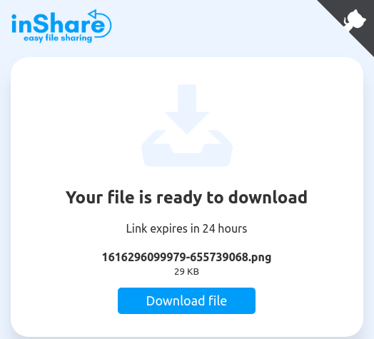
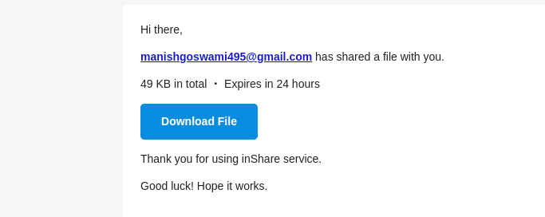

# inshare-File- sharing app-using-NodeJs-Express-and-Mongo-DB

inShare file sharing app apis
Rest api using Node, Express, Mongo. We will build rest api for a simple file sharing app.

#Upload file and it will generate the link



This project was generated with Sass , Nodejs ,ExpressJS  MongoDB & LaravelMix.

### Mail format



 Quick Start

### Install Node.js ,Expressjsand MongoDB:
```sh
$ git clone https://github.com/manish0502/Building-inshare-for-file-sharing-using-MEAN-stack.git
$ npm i and  npm run dev
$ http://localhost:3000/ 
```
## Development server

Run `npm run server` for a dev server. Navigate to `http://localhost:3000/`. The app will automatically reload if you change any of the source files.

## API

```   
   * http://localhost:3000/api/files  (post : upload file)
   * http://localhost:3000/files/8f375152-bb83-4985-b060-49f38e2baa37(uuid)   (get : download file)
   * http://localhost:3000/api/files/send  (post : send email )
   

```


## Tools
```sh
 * SASS , passport-local for authentication ,ejs
 * Nodejs , ExpressJs , Mongo-connect ,cors
 * NPM , MongoDB , multer
 * Animate.css - Animation library, use with ng-animate
 * Moment ,uuid
```

## Overall Directory Structure


### What follows is a brief description of each entry, but most directories contain their own README.md file with additional documentation, so browse around to learn more.

 * `NodeJs/ `- Node.js is an open-source, cross-platform, back-end JavaScript runtime environment that runs on the V8 engine and executes JavaScript code outside  a web browser.
 * `ExpressJs/` - Express.js, or simply Express, is a back end web application framework for Node.js * 
 *  `PassportJS`- Passport is authentication middleware for Node.js. Extremely flexible and modular, Passport can be unobtrusively dropped in to any Express-based web application. A comprehensive set of strategies support authentication using a username and password, Facebook, Twitter, and more..
 * `Noty-npm` - Noty is a dependency-free notification library that makes it easy to create alert - success - error - warning - information - confirmation messages .
 *` Moment` - A JavaScript date library for parsing, validating, manipulating, and formatting dates. Project Status. Moment.js is a legacy project.
 * `bcrypt` - The bcrypt library on NPM makes it really easy to hash and compare passwords in Node.
 * `module.prefix and module.suffix` - our compiled application script is wrapped in these, which by default are used to place the application inside a self-    
 * `package.json` - metadata about the app, used by NPM and our build script. Our NPM dependencies are listed here.


  
## For Running 

Run `npm run dev` to Start it . You can also use `npm run start , npm run --watch`.
After download or clone run npm install OR yarn install to install all the dependancies. also do not forget to rename .env.example into .env an put all creadentials.
``

pray If you find this repo helpful then don't forget to give a start sparkle to this repository. :)
